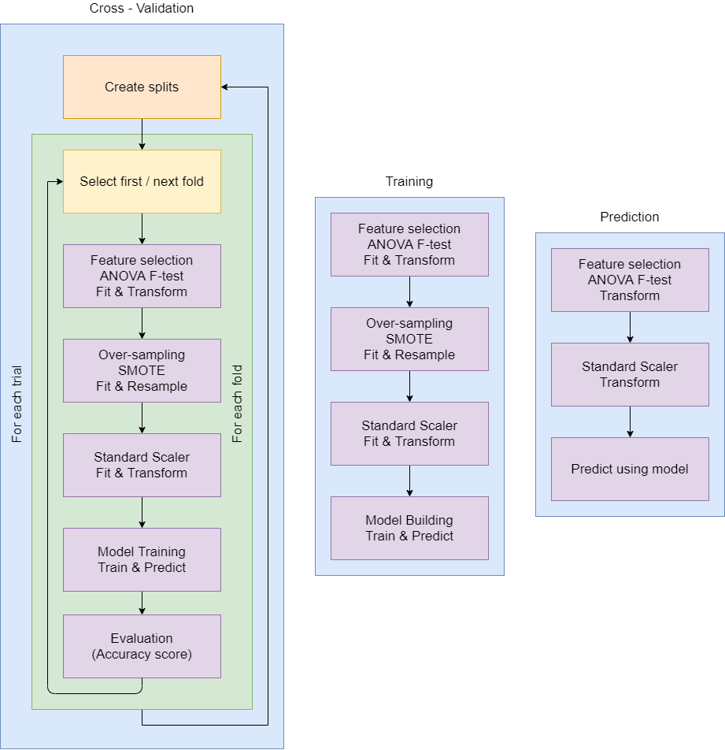
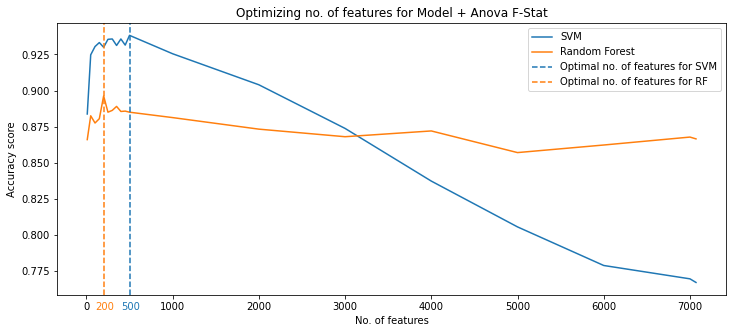
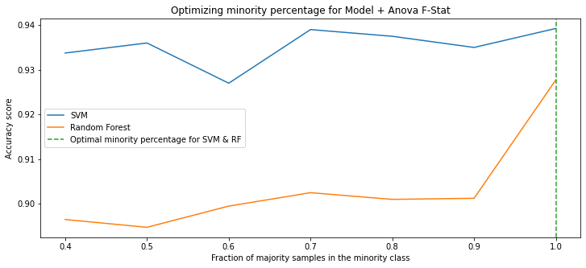
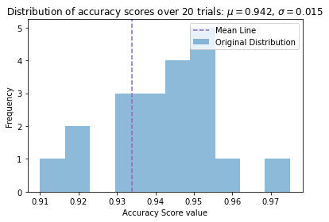
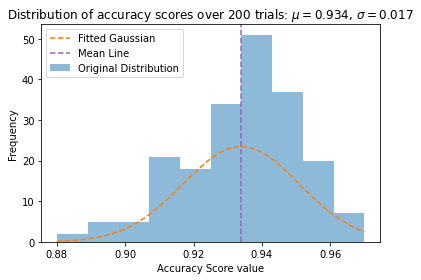
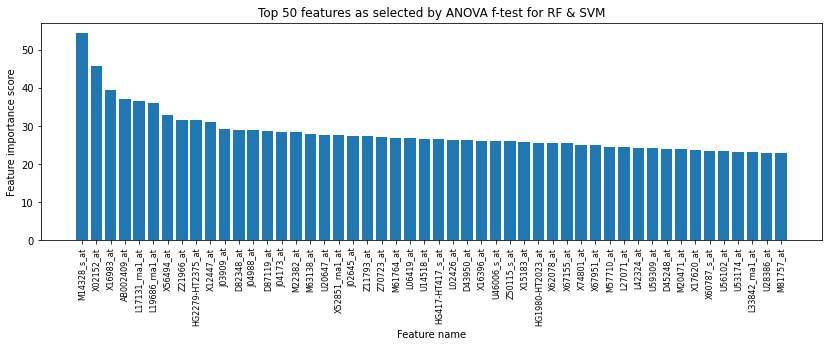
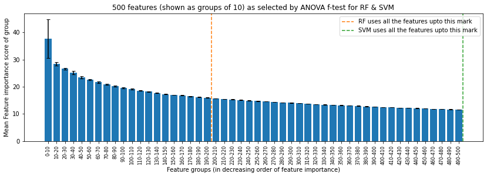

# Diffuse large B-cell & Follicular lymphoma classification using ANOVA F-test feature selection method, SMOTE for over-sampling, & SVM, Random Forest classifiers

**Project Report by Anubhab Das** 

Date : 27th May, 2021

## Objective & data

Text goes here

Data Source : [Link](https://file.biolab.si/biolab/supp/bi-cancer/projections/info/DLBCL.html)

**Note : Text.**

## Model & Training details

### Pipelines

The cross-validation pipeline needed extra care while designing to avoid any data leakage or other forms of overfitting which could be caused by performing scaling, oversampling & feature selection in the wrong order.

### Data Augmentation
Text goes here.

## Evaluation & test performance
Text goes here.

### Finding optimal values of SMOTE minority fraction & no. of features in feature selection
 

### Distribution of accuracy scores across various trials of cross-validation
 

### Feature importance scores 
 

### Cross Validation
Text goes here

### Prediction
Text goes here

## Limitations and further improvements :
1. Lim1
2. Lim2

## References
1. [Ref1](google.com)
2. [Ref2](google.com)
